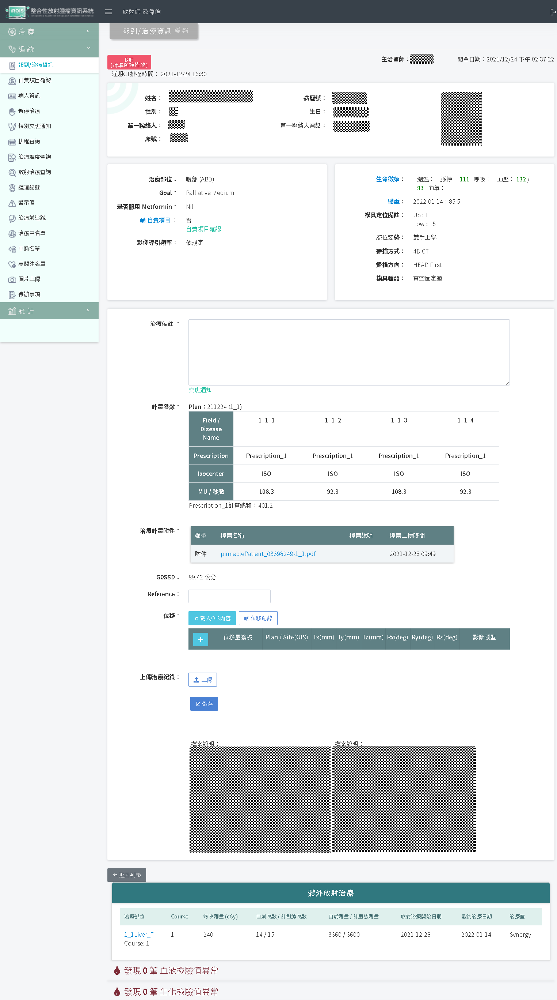
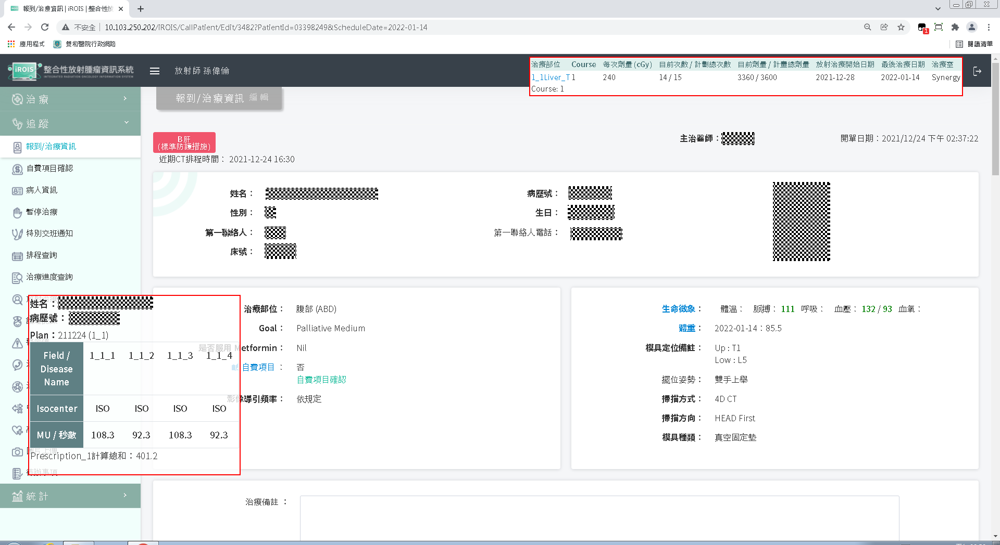

# iROIS-CallPatient-doseinfo-always-on-top

置頂顯示 iROIS 之計畫參數

## 功能

當治療病人時，放射治療師會從 iROIS 的報到/治療資訊中點選要治療的病人，並核對各項參數無誤後才進行治療，但 iROIS 預設的頁面配置把計畫參數和治療記錄**放在頁面的最下方**，這樣每次治療時都必須捲動頁面才能核對病人資訊並執行治療，**非！常！麻！煩！**

這個程式的用途就是將 iROIS 報到/治療資訊中病人之計畫參數/治療記錄置頂顯示，避免需要一直上下捲動造成的不便。

## 使用方法

這是一隻 userscript 程式，若要使用請先在你的瀏覽器安裝能執行 userscript 的擴充套件：

* Chrome , Edge 可安裝  [Tampermonkey](https://chrome.google.com/webstore/detail/tampermonkey/dhdgffkkebhmkfjojejmpbldmpobfkfo?hl=zh-TW)
* Firefox 可安裝 [Violentmonkey](https://addons.mozilla.org/zh-TW/firefox/addon/violentmonkey/)

之後下載並從上述的套件中匯入 **iROIS 小幫手- 報到-治療資訊版面優化.user.js** 即可。

下次開啟 iROIS 的報到/治療資訊中每個病人的編輯畫面就會看到變化。

## 範例

### 使用前

### 使用後

## 從此人生都完美了！
